# WhiteHole
 
WhiteHole: Secure, mnemonic-free wallet with crosschain decentralized chat, smart savings, QR, FaceDID and card payments—powered by Base.

## Fast Links:

WALLET CODE: [CODE](./WhiteHole%20RN/)

PLAYSTORE LINK: [LINK](https://play.google.com/store/apps/details?id=com.altaga.whitehole.base)

VIDEODEMO: [VIDEO]()

# System Diagram:

## Circle Services:

- Programmable Wallets: To improve the user experience and security in the management of their crypto assets, we decided to implement Developer Controlled Wallets, allowing users to manage their assets safely and without the risk of losing their private keys.

  - Main Account: Within the schematics you can see that we have our main wallet, which is a [Developer Controlled Wallet](https://developers.circle.com/w3s/developer-controlled-wallet-quickstart), you won’t have to worry about remembering your mnemonic because Circle protects your wallet. More details in the following section [Main Account](#assets-management).

  - Savings Account: This wallet, like the previous one, is a [Developer Controlled Wallet](https://developers.circle.com/w3s/developer-controlled-wallet-quickstart), which will save the savings on each transaction according to the chosen savings protocol. More details in the following section [Savings Account](#smart-savings).

  - Card Account: This wallet, like the previous one, is a [Developer Controlled Wallet](https://developers.circle.com/w3s/developer-controlled-wallet-quickstart), however, unlike the previous ones, this one can only carry out transactions when it is used with the physical card that was used to create it. More details in the following section [Web3 Card](#recommended-token).

- USDC and EURC: We have incorporated stablecoins such as USDC and EURC as recommended payment options, as they maintain a 1:1 ratio with real assets, allowing businesses and users to send and receive crypto assets safely without risking market volatility. More details in the following section [Payment Example](#payment-example).

- Smart Contract Platform: In this case, the application is used to manage information on various contracts of our creation, in order to better organize the contracts we have in each network. More details in the section [SCP](#smart-contract-platform-batch-balances).

- CCTP: We use the CCTP service that Wormhole already has integrated as a Circle Relayer. This allows us to easily perform Cross Chain Transfers of USDC. More details in the following section [CCTP](#cctp-wormhole-integration).

## Wormhole Services:

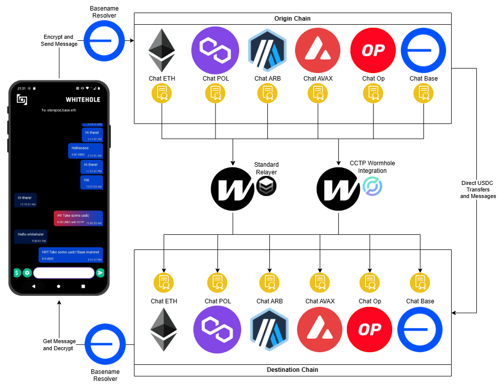

- Standard Relayer: We use this relayer in our chat contract to be able to communicate messages between chains. More details in the following section [Standard Relayer](#standard-relayer).

- Circle Relayer: We use this second specialized relayer due to the ease of being able to make cross-chain transfers of USDC between the different chains that our project manages. More details in the following section [Circle Relayer](#cctp-wormhole-integration).
  
# Features:

Now we are going to describe the main features of our application as well as the technical implementation that these have in relation to the Circle and Wormhole technologies.

## Main Account:

Like any wallet on the market, we first had to cover its basic functions. In this case, it is being able to manage the user's crypto assets, as well as the functions of receiving or sending them. In this case, the implementation of USDC and EURC is a priority. Since these are stablecoins, they provide us with the savings and adoption capacity that we seek to solve. [1](#references)

  

All technical implementations for main wallet are included here.

- [TAB CODE](./WhiteHole/src/screens/main/tabs/tab1.js)

### Developer Controlled Wallets:

All assets held by this wallet are fully available to the user, however not the private keys, these are controlled by the Developer Controlled Wallets platform. All wallets created to be used as Main are created with the prefix `user_`.

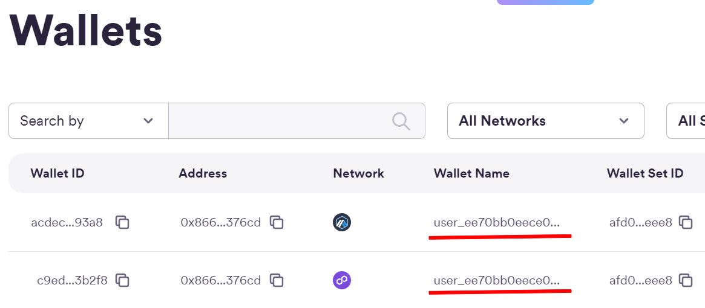

In addition, all the transactions that we want to invoke using this method are controlled from our API in [Google Cloud](./Cloud/). Since the Main wallet can perform transfers of Native tokens and ERC20 Tokens we need the following 2 functions for this.

- Transfer Native Token.

      const transaction = {
          amount: [amount],
          destinationAddress,
          walletId,
          blockchain: blockchains[req.body.chain],
      };
      let response = await circleDeveloperSdk.createTransaction({
          ...transaction,
          fee: {
          type: "level",
          config: {
              feeLevel: "MEDIUM",
          },
          },
      });

- Transfer ERC20 Tokens:

      const interface = new ethers.utils.Interface(abiERC20);
      const transaction = interface.encodeFunctionData("transfer", [
          destinationAddress,
          ethers.utils.parseUnits(amount, token.decimals),
      ]);
      let response = await circleDeveloperSdk.createContractExecutionTransaction({
          walletId,
          callData: transaction,
          contractAddress: token.address,
          fee: {
          type: "level",
          config: {
              feeLevel: "MEDIUM",
          },
          },
      });

All technical implementations for transactions are included here.

- [CLOUD TRANSFER](./Cloud/createTransfer/index.js)

### Smart Contract Platform (Batch Balances):

Part of our wallet's UI/UX relies on being able to get the balance of multiple tokens at the same time. However, making the call to all of these contracts at the same time can be time-consuming, so we made a contract that is able to make a batch call of all the ERC20 Tokens we want in a single RPC call. This was deployed to each of the chains supported by the platform and the rest via Remix.

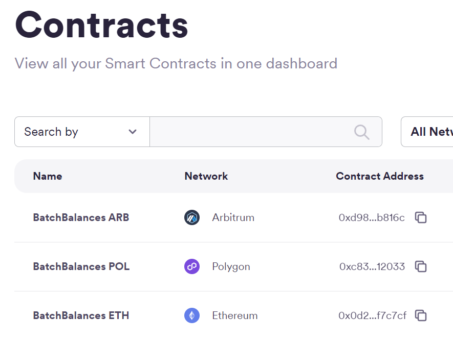

All technical implementations for this contract are included here.

- [BATCH BALANCES](./Contracts/BatchBalances.sol)

## Smart Savings:

One of the missions of our application is to encourage constant savings, this is normally done through financial education and good consumption habits. However, we go one step further, we make small savings in each purchase and transaction that the user makes.

  

The savings account has a couple of customizable functions.

- Activate Savings: This switch allows you to turn the savings account on and off, so that the user can stop attaching savings transactions to each purchase.

- Savings Period: This drop-down menu allows the user to set a savings goal, whether daily, weekly, monthly or yearly. NOTE: For now it is possible to change it without limitations, but we do not want the user to be able to remove the fixed date of their savings until the deadline is met.

- Savings Protocol: This drop-down menu gives us two options, percentage savings, which will take the percentage that we configure in each purchase or smart savings.

All technical implementations for savings wallet are included here.

- [TAB CODE](./WhiteHole/src/screens/main/tabs/tab2.js)

### Savings Protocol:

- Balanced Protocol, this protocol performs a weighted rounding according to the amount to be paid in the transaction, so that the larger the transaction, the greater the savings, in order not to affect the user. And this is the function code:

        export function balancedSavingToken(number, usd1, usd2) {
            const balance = number * usd1;
            let amount = 0;
            if (balance <= 1) {
                amount = 1;
            } else if (balance > 1 && balance <= 10) {
                amount = Math.ceil(balance);
            } else if (balance > 10 && balance <= 100) {
                const intBalance = parseInt(balance, 10);
                const value = parseInt(Math.round(intBalance).toString().slice(-2), 10);
                let unit = parseInt(Math.round(intBalance).toString().slice(-1), 10);
                let decimal = parseInt(Math.round(intBalance).toString().slice(-2, -1), 10);
                if (unit < 5) {
                unit = '5';
                decimal = decimal.toString();
                } else {
                unit = '0';
                decimal = (decimal + 1).toString();
                }
                amount = intBalance - value + parseInt(decimal + unit, 10);
            } else if (balance > 100) {
                const intBalance = parseInt(Math.floor(balance / 10), 10);
                amount = (intBalance + 1) * 10;
            }
            return new Decimal(amount).sub(new Decimal(balance)).div(usd2).toNumber();
        }

- Percentage protocol, unlike the previous protocol, this one aims to always save a percentage selected in the UI.

        export function percentageSaving(number, percentage) {
            return number * (percentage / 100);
        }

All technical implementations for savings protocols are included here.

- [SAVINGS PROTOCOLS](./WhiteHole/src/utils/utils.js)

### Developer Controlled Wallets:

All the assets that this wallet maintains are completely available to the user, the application allows you to change the "lock" time that the savings will have, until this time has passed the user will not be able to access the funds that are stored in this wallet, all wallets created to be used as Savings are created with the prefix `saving_`.

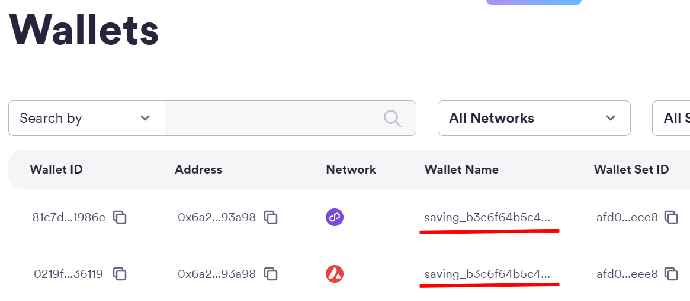

In this case, the transaction to withdraw funds once the savings period has ended works in the same way as explained above. [HERE](#developer-controlled-wallets)

All technical implementations for transactions are included here.

- [CLOUD TRANSFER](./Cloud/createTransfer/index.js)

## Web3 Card:

Part of people's daily adoption of crypto is being able to use it in the same way they use their cell phone or card to make payments, but without neglecting the security and decentralization of crypto. [2](#references)

  

### Contactless Payment:

Payment cards are not just a traditional NFC chip, in fact they are more like small computers with installed programs, which run in milliseconds at the time the chip is being scanned. [3](#references)

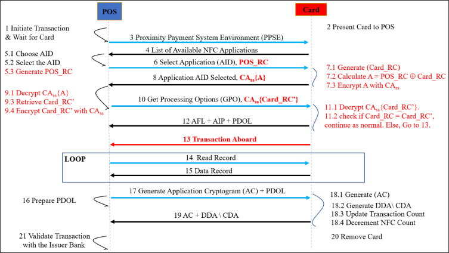

So we implemented this card reading to be able to read the sensitive data of the payment cards and with this be able to generate a virtual card that could be used for crypto payments.

All technical implementations for this feature are included here.

- [READ CARD CODE](./WhiteHole/src/screens/main/components/readCard.js)

### Developer Controlled Wallets:

All assets held by this wallet are fully available to the user, however unlike previous wallets the funds are only transferred once payment is made with the physical card linked to this account, all wallets created to be used as Savings are created with the prefix `card_`.

In this case the transaction to withdraw funds works in the same way. [HERE](#developer-controlled-wallets), However, this is only executed if it is read or if it is executed with the private information of the physical card linked to the card. 

#### Payment Example:

The merchant can easily execute a payment by opening the payment tab. The payment is the same as making a payment at any current POS, simply by entering the amount in dollars, swiping the card and either the customer or the merchant selecting the token they wish to pay with.

NOTE: We place stablecoins such as USDC and EURC as the first options whenever a payment is made since the purpose of the project is for these to be used preferentially.

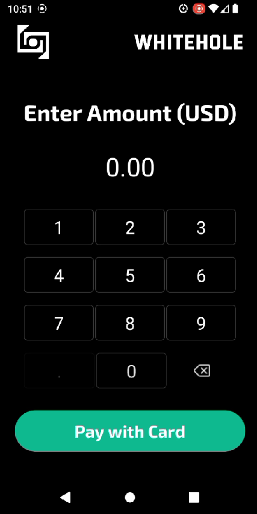 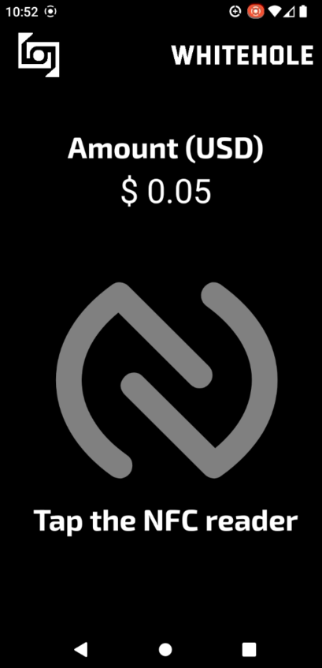 

Finally, once the token to pay has been selected, we can see the status in the mainnet explorer, if the hardware allows it, print the receipt for the customer or return to the main menu to make another payment.

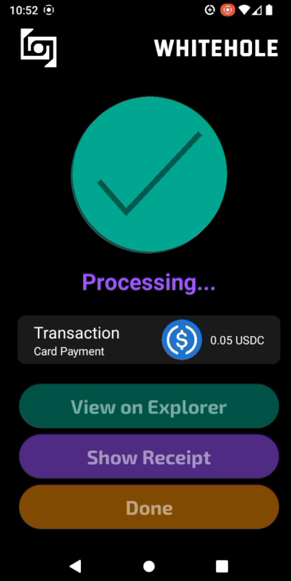 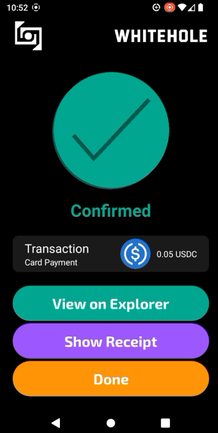 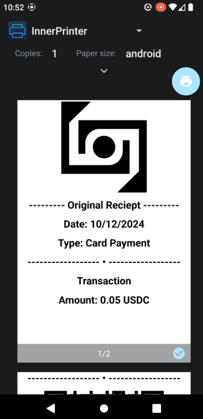

All technical implementations for transactions are included here.

- [TAB CODE](./WhiteHole/src/screens/paymentWallet/paymentWallet.js)
- [READ CARD CODE](./WhiteHole/src/screens/main/components/readCard.js)
- [CLOUD TRANSFER](./Cloud/createTransfer/index.js)

## MultiChainChat:

The last but not least important part of our project was the development of a cross-chain chat which allows users to send messages in a completely decentralized way and with the certainty that the communication between them is completely encrypted and secure. In addition to the ability to make USDC transfers either on the same chain or crosschain (CCTP). This feature allows us to increase the adoption and use of crypto since today there are already alternatives to do this in TradFi such as Venmo or WeChat Pay. [4](#references)

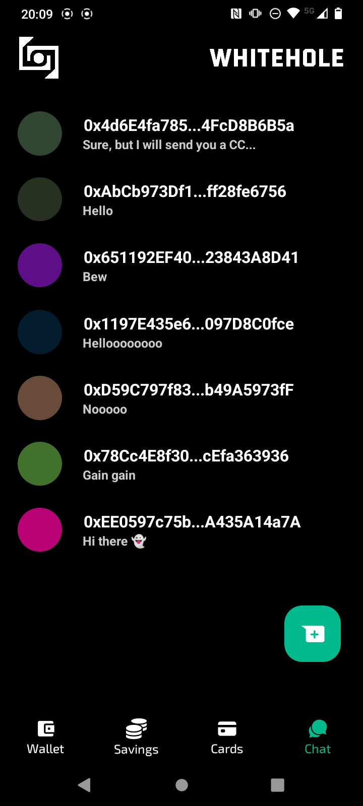 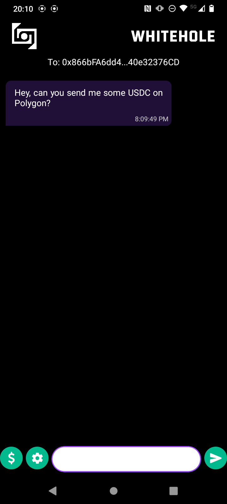

All code was developed using the Foundry tool.

[ENVIRONMENT](./multichain-chat/)

We generate several scripts that make it easier for the user to deploy the entire chat infrastructure themselves. These scripts allow you to calculate the cost, deploy and configure absolutely everything.

- Deploy Estimation: This script gives us the cost that the deployment of the contracts will have in each of the chains that you configure in the file [chains.json](./multichain-chat/deploy-config/chains.json).
  - [CODE](./multichain-chat/script/deployChatEstimation.js)

- Deploy Chat: This script allows you to deploy the contract in each of the chains and at the same time configure them in such a way that they can communicate with each other. This process can be a bit slow depending on the chains you configure, since for each chain you add each contract in each chain will have to be added to each other.
  - [CODE](./multichain-chat/script/deployChat.js)

- Send Message Estimation: This script allows us to make a quote of what the cost will be to send a message from Chain A to Chain B. We recommend making some quotes to ensure that the costs are acceptable.
  - [CODE](./multichain-chat/script/sendMessageEstimation.js)

- Send Message: This script allows you to send a message from the wallet you have configured as a fee payer to another address you decide to add, from Chain A to Chain B.
  - [CODE](./multichain-chat/script/sendMessage.js)
  
- Get Messages: Finally, this script allows you to retrieve by address all messages in the chat that are registered from or for a particular address.
  - [CODE](./multichain-chat/script/getMessages.js)

### Standard Relayer:

All messages going from one chain to another use the Standard Relayer to send cross-chain information. This is implemented in our MultiChainChat.sol contract in the following functions.

- Send Crosschain Message: (Origin Chain)

      function sendMessage(
          uint16 targetChain,
          address targetAddress,
          uint256 _GAS_LIMIT,
          // Chat Data
          address to,
          string memory messFrom,
          string memory messTo,
          string memory iv,
          uint256 amount
      ) external payable {
          uint256 cost = quoteCrossChainCost(targetChain, _GAS_LIMIT); // Dynamically calculate the cross-chain cost
          require(
              msg.value >= cost,
              "Insufficient funds for cross-chain delivery"
          );
          wormholeRelayer.sendPayloadToEvm{value: cost}(
              targetChain,
              targetAddress,
              abi.encode(
                  wormholeChainId,
                  targetChain,
                  msg.sender,
                  to,
                  messFrom,
                  messTo,
                  iv,
                  amount,
                  block.timestamp
              ),
              0, // No receiver value needed
              _GAS_LIMIT // Gas limit for the transaction
          );
      }

- Receive Message: (Target Chain)

      function receiveWormholeMessages(
        bytes memory payload,
        bytes[] memory, // additional VAAs (optional, not needed here)
        bytes32 sourceAddress,
        uint16 sourceChain,
        bytes32 // delivery hash
      ) public payable override isRegisteredSender(sourceChain, sourceAddress) {
        require(
            msg.sender == address(wormholeRelayer),
            "Only the Wormhole relayer can call this function"
        );
        // Decode the payload to extract the message
        (
            uint16 fromChainId,
            uint16 toChainId,
            address from,
            address to,
            string memory messFrom,
            string memory messTo,
            string memory iv,
            uint256 amount,
            uint256 blocktime
        ) = abi.decode(
                payload,
                (uint16, uint16, address, address, string, string, string, uint256, uint256)
            );
        // Setup Struct
        Message memory message = Message(
            fromChainId,
            toChainId,
            from,
            to,
            messFrom,
            messTo,
            iv,
            amount,
            blocktime
        );
        // Add Message to Chat
        addMessageWormhole(message);

        // Example use of sourceChain for logging
        if (sourceChain != 0) {
            emit SourceChainLogged(sourceChain);
        }

        // Emit an event with the received message
        emit MessageReceived(message.iv);
      }

All technical implementations for this contract are included here.

- [MultiChainChat](./Contracts/MultiChainChat.sol)

### CCTP Wormhole Integration:

Being able to transfer messages from one chain to another is essential for a cross-chain chat to work properly, but for this to be a viable product we had to be able to send USDC as well, since we want to follow the same business model as companies like Venmo or WeChat Pay but in a web3 version. So for this it was necessary to use Wormhole's Circle Relayer, which is a version of CCTP that Wormhole already has implemented and is very easy to use. However, in order to use this contract we created an interface contract that allows us to use this contract more easily.

    interface ICircleRelayer {
    event SwapExecuted(
        address indexed recipient,
        address indexed relayer,
        address indexed token,
        uint256 tokenAmount,
        uint256 nativeAmount
    );

    function VERSION() external view returns (string memory);

    function transferTokensWithRelay(
        IERC20Metadata token,
        uint256 amount,
        uint256 toNativeTokenAmount,
        uint16 targetChain,
        bytes32 targetRecipientWallet
    ) external payable returns (uint64 messageSequence);

    function bytes32ToAddress(bytes32 address_) external pure returns (address);
    }

All technical implementations for this interface are included here.

- [Circle Relayer Interface](./Contracts/ICircleRelayer.sol)

### Smart Contract Platform (Chat Contracts):

We group the contracts deployed with the Foundry Environment on our Circle platform in order to have better control and visualization of the contracts necessary for the project.

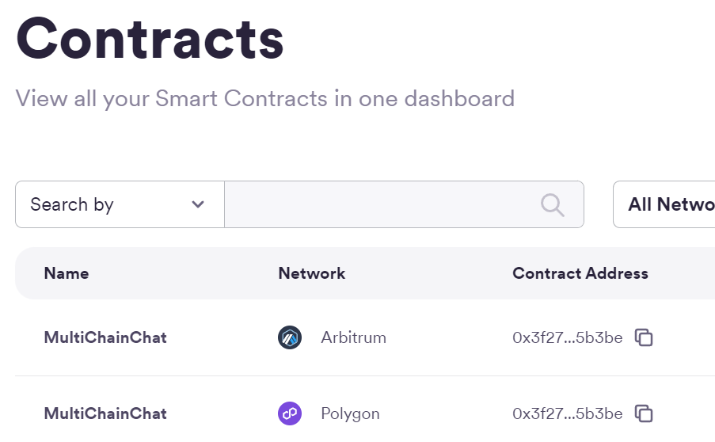

### Developer Controlled Wallets:

Unlike just transferring assets, interacting with MultiChainChat and Circle Relayer smart contracts required some additional considerations when using Developer Controlled Wallets. We will explain the most important functions used to make this possible, however all the code will be available at the end of this section.

- Send Message Cross-chain with Programmable Wallets: This type of transaction can be done in just one transaction. It is executed using circle's Javascript SDK.

      const data = chatInterface.encodeFunctionData('sendMessage', [
        this.context.value.toChain,
        chains[index2].crossChainChat,
        gas_limit,
        to,
        messFrom,
        messTo,
        iv,
        ethers.utils.parseUnits(
          this.state.amount === '' ? '0' : this.state.amount,
          6,
        ),
      ]);
      let response = await circleDeveloperSdk.createContractExecutionTransaction({
          walletId,
          amount: myamount,
          callData: data,
          contractAddress: chatSelector[fromChain],
          fee: {
              type: "level",
              config: {
                  feeLevel: "MEDIUM",
              },
          },
      });

- Send CCTP transfer: In addition to the cross-chain message that is sent in the chat, making a transfer from the Circle Relayer involves 2 steps, which is to approve the amount to be transferred from the Developer Programmable Wallet and then execute the transaction to make the transfer with the relayer.

      let interface = new ethers.utils.Interface(abiERC20);
      let transaction = interface.encodeFunctionData("approve", [
          circleRelayerAddress,
          amount
      ]);
      let response = await circleDeveloperSdk.createContractExecutionTransaction({
          walletId,
          callData: transaction,
          contractAddress: usdcSelector[fromChain],
          fee: {
              type: "level",
              config: {
                  feeLevel: "MEDIUM",
              },
          },
      });
      const { id: myId } = response.data;
      await new Promise((resolve) => {
          const interval = setInterval(async () => {
              response = await circleDeveloperSdk.getTransaction({
                  id:myId,
              });
              if (response.data.transaction.state === "CONFIRMED") {
                  clearInterval(interval);
                  resolve(response.data.transaction.txHash);
              }
          }, 1000);
      });
      interface = new ethers.utils.Interface(abiCircleRelayer);
      transaction = interface.encodeFunctionData("transferTokensWithRelay", [
          usdcSelector[fromChain],
          amount,
          0,
          toChain,
          addressToBytes32(to)
      ]);
      response = await circleDeveloperSdk.createContractExecutionTransaction({
          walletId,
          callData: transaction,
          contractAddress: circleRelayerAddress,
          fee: {
              type: "level",
              config: {
                  feeLevel: "MEDIUM",
              },
          },
      });

All technical implementations for this interface are included here.

- [Circle Relayer Interface](./Contracts/ICircleRelayer.sol)

### UI/UX:

Although this process may seem somewhat complicated, for the user it is as simple as choosing the source chain, the target chain, the amount to send and pressing the send button. All this abstraction is thanks to Wormhole and Circle.

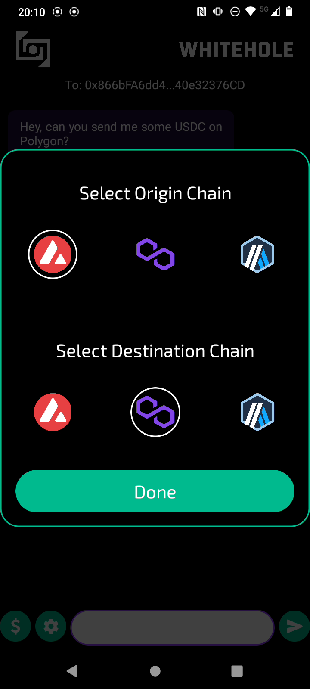 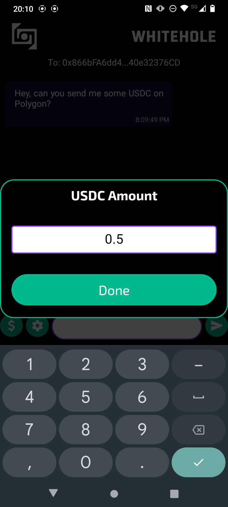 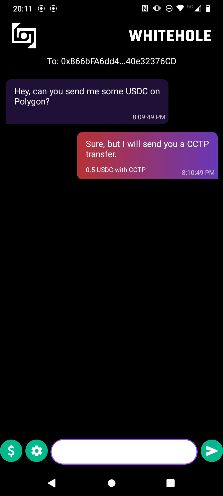

# References:

1. https://cointelegraph.com/news/stablecoin-issuer-circle-partners-sony-blockchain-lab-usdc-expansion
2. https://www.triple-a.io/cryptocurrency-ownership-data
3. https://medium.com/@androidcrypto/talk-to-your-credit-card-android-nfc-java-d782ff19fc4a
4. https://stripe.com/en-mx/resources/more/text-to-pay-101-what-it-is-how-it-works-and-how-to-implement-it

