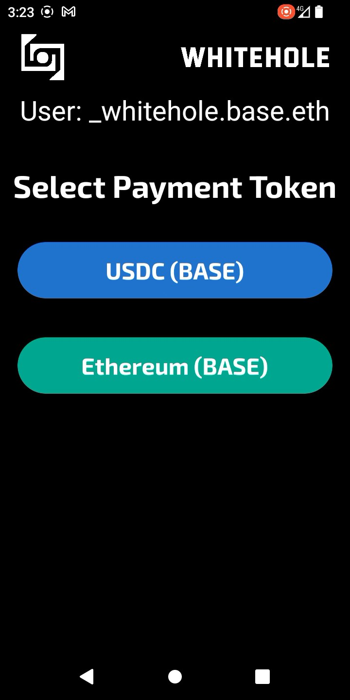
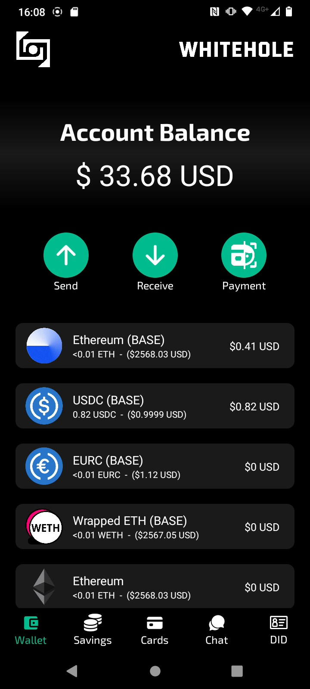

# WhiteHole
 
WhiteHole: Secure, mnemonic-free wallet with crosschain decentralized chat, smart savings, QR, FaceDID and card payments—powered by Base.


## Fast Links:

WALLET CODE: [CODE](./WhiteHole%20RN/)

PLAYSTORE LINK: [LINK](https://play.google.com/store/apps/details?id=com.altaga.whitehole.base)

VIDEODEMO: [VIDEO](https://youtu.be/7ZjjKlUkQCA)

# System Diagrams:

## Payments Diagram:


- Basenames: We implemented Basenames as user identities, so all payment methods are validated with the basename and the user ID shown, whether it's a face, QR code, or bank card.

- Networks: Although the wallet is focused on using Base Mainnet, it is compatible with all other popular networks in the Ethereum ecosystem.

- Face Recognition: For payments made by face, a biometric identity check and anti-spoofing filter are performed.

- USDC and EURC: We have incorporated stablecoins such as USDC and EURC as recommended payment options, as they maintain a 1:1 ratio with real assets, allowing businesses and users to send and receive crypto assets safely without risking market volatility.

## Chat Diagram:


- Basenames: We implemented Basenames as chat identifiers and as an easy way to send messages and transfer on-chain or cross-chain.

- Standard Relayer: We use this relayer in our chat contract to be able to communicate messages between chains.

- Circle Relayer: We use this second specialized relayer due to the ease of being able to make cross-chain transfers of USDC between the different chains that our project manages.

# Features:

Now we are going to describe the main features of our application as well as the technical implementation that these have in relation to the Base Mainnet.

## Basenames:

Within our wallet, we use a custom component that is responsible for providing the wallet with all the Basename-based features as well as resolving their ENS.

  

This component has the following functions.

- Get the correct cointype.

    ```javascript
    export const convertChainIdToCoinType = chainId => {
    // L1 resolvers to addr
    if (chainId === mainnet.id) {
        return 'addr';
    }
    const cointype = (0x80000000 | chainId) >>> 0;
    return cointype.toString(16).toLocaleUpperCase();
    };
    ```
- Get the reverse node based on the address and chain.

    ```javascript
    export const convertReverseNodeToBytes = (address, chainId) => {
    const addressFormatted = address.toLocaleLowerCase();
    const addressNode = keccak256(addressFormatted.substring(2));
    const chainCoinType = convertChainIdToCoinType(chainId);
    const baseReverseNode = namehash(
        `${chainCoinType.toLocaleUpperCase()}.reverse`,
    );
    const addressReverseNode = keccak256(
        encodePacked(['bytes32', 'bytes32'], [baseReverseNode, addressNode]),
    );
    return addressReverseNode;
    };
    ```

- Get the final Basename.

    ```javascript
    export async function getBasename(address) {
    const provider = setupProvider(blockchains[0].rpc);
    const contract = new Contract(
        '0xC6d566A56A1aFf6508b41f6c90ff131615583BCD',
        basenamesABI,
        provider,
    );
    const addressReverseNode = convertReverseNodeToBytes(address, base.id);
    const name = await contract.name(addressReverseNode);
    return name === '' ? address : name;
    }
    ```

All technical implementations for Basename Resolver are included here.
- [Component CODE](./WhiteHole%20RN/src/components/baseName.js)

## Main Account:

Like any wallet on the market, we first had to cover its basic functions. In this case, it is being able to manage the user's crypto assets, as well as the functions of receiving or sending them. In this case, the implementation of USDC and EURC is a priority. Since these are stablecoins, they provide us with the savings and adoption capacity that we seek to solve. [1](#references)

  

All technical implementations for main wallet are included here.

- [TAB CODE](./WhiteHole%20RN/src/screens/main/tabs/tab1.js)

###  Wallets:

All assets held by this wallet are fully available to the user, however not the private keys, these are controlled by the Developer Controlled Wallets platform and all the transactions that we want to invoke using this method are controlled from our API in [Google Cloud](./Cloud/). Since the Main wallet can perform transfers of Native tokens and ERC20 Tokens we need the following 2 functions for this.

- Transfer Native Token.

      const transaction = {
          amount: [amount],
          destinationAddress,
          walletId,
          blockchain: blockchains[req.body.chain],
      };
      let response = await circleDeveloperSdk.createTransaction({
          ...transaction,
          fee: {
          type: "level",
          config: {
              feeLevel: "MEDIUM",
          },
          },
      });

- Transfer ERC20 Tokens:

      const interface = new ethers.utils.Interface(abiERC20);
      const transaction = interface.encodeFunctionData("transfer", [
          destinationAddress,
          ethers.utils.parseUnits(amount, token.decimals),
      ]);
      let response = await circleDeveloperSdk.createContractExecutionTransaction({
          walletId,
          callData: transaction,
          contractAddress: token.address,
          fee: {
          type: "level",
          config: {
              feeLevel: "MEDIUM",
          },
          },
      });

All technical implementations for transactions are included here.

- [CLOUD TRANSFER](./Cloud/createTransfer/index.js)

### Batch Balances:

Part of our wallet's UI/UX relies on being able to get the balance of multiple tokens at the same time. However, making the call to all of these contracts at the same time can be time-consuming, so we made a contract that is able to make a batch call of all the ERC20 Tokens we want in a single RPC call. This was deployed to each of the chains supported by the platform and the rest via Remix.

```javascript
function batchBalanceOf(
    address _owner,
    address[] memory _tokenAddresses
) public view returns (uint256[] memory) {
    // Initialize an array to store balances for each token
    uint256[] memory balances = new uint256[](_tokenAddresses.length);

    // Loop through each token address and fetch the balance for _owner
    for (uint256 i = 0; i < _tokenAddresses.length; i++) {
        balances[i] = ERC20(_tokenAddresses[i]).balanceOf(_owner);
    }

    // Return the array of balances
    return balances;
}
```

All technical implementations for this contract are included here.

- [BATCH BALANCES](./Contracts/BatchBalances.sol)

## Smart Savings:

One of the missions of our application is to encourage constant savings, this is normally done through financial education and good consumption habits. However, we go one step further, we make small savings in each purchase and transaction that the user makes.

  

The savings account has a couple of customizable functions.

- Activate Savings: This switch allows you to turn the savings account on and off, so that the user can stop attaching savings transactions to each purchase.

- Savings Period: This drop-down menu allows the user to set a savings goal, whether daily, weekly, monthly or yearly. NOTE: For now it is possible to change it without limitations, but we do not want the user to be able to remove the fixed date of their savings until the deadline is met.

- Savings Protocol: This drop-down menu gives us two options, percentage savings, which will take the percentage that we configure in each purchase or smart savings.

All technical implementations for savings wallet are included here.

- [TAB CODE](./WhiteHole%20RN/src/screens/main/tabs/tab2.js)

### Savings Protocol:

- Balanced Protocol, this protocol performs a weighted rounding according to the amount to be paid in the transaction, so that the larger the transaction, the greater the savings, in order not to affect the user. And this is the function code:

    ``` javascript
    export function balancedSavingToken(number, usd1, usd2) {
        const balance = number * usd1;
        let amount = 0;
        if (balance <= 1) {
            amount = 1;
        } else if (balance > 1 && balance <= 10) {
            amount = Math.ceil(balance);
        } else if (balance > 10 && balance <= 100) {
            const intBalance = parseInt(balance, 10);
            const value = parseInt(Math.round(intBalance).toString().slice(-2), 10);
            let unit = parseInt(Math.round(intBalance).toString().slice(-1), 10);
            let decimal = parseInt(Math.round(intBalance).toString().slice(-2, -1), 10);
            if (unit < 5) {
            unit = '5';
            decimal = decimal.toString();
            } else {
            unit = '0';
            decimal = (decimal + 1).toString();
            }
            amount = intBalance - value + parseInt(decimal + unit, 10);
        } else if (balance > 100) {
            const intBalance = parseInt(Math.floor(balance / 10), 10);
            amount = (intBalance + 1) * 10;
        }
        return new Decimal(amount).sub(new Decimal(balance)).div(usd2).toNumber();
    }
    ```

- Percentage protocol, unlike the previous protocol, this one aims to always save a percentage selected in the UI.

    ``` javascript
    export function percentageSaving(number, percentage) {
        return number * (percentage / 100);
    }
    ```

All technical implementations for savings protocols are included here.

- [SAVINGS PROTOCOLS](./WhiteHole%20RN/src/utils/utils.js)

## Web3 Card:

Part of people's daily adoption of crypto is being able to use it in the same way they use their cell phone or card to make payments, but without neglecting the security and decentralization of crypto. [2](#references)

  

### Contactless Payment:

Payment cards are not just a traditional NFC chip, in fact they are more like small computers with installed programs, which run in milliseconds at the time the chip is being scanned. [3](#references)


So we implemented this card reading to be able to read the sensitive data of the payment cards and with this be able to generate a virtual card that could be used for crypto payments.

All technical implementations for this feature are included here.

- [READ CARD CODE](./WhiteHole%20RN/src/screens/main/components/readCard.js)

#### Card Payment Example:

The merchant can easily execute a payment by opening the payment tab. The payment is the same as making a payment at any current POS, simply by entering the amount in dollars, swiping the card and either the customer or the merchant selecting the token they wish to pay with.

NOTE: We place stablecoins such as USDC and EURC as the first options whenever a payment is made since the purpose of the project is for these to be used preferentially.

  

Finally, once the token to pay has been selected, we can see the status in the mainnet explorer, if the hardware allows it, print the receipt for the customer or return to the main menu to make another payment.

  

All technical implementations for transactions are included here.

- [TAB CODE](./WhiteHole%20RN/src/screens/paymentWallet/paymentWallet.js)
- [READ CARD CODE](./WhiteHole%20RN/src/screens/main/components/readCard.js)
- [CLOUD TRANSFER](./Cloud/createTransfer/index.js)

## FaceDID and QR:

Part of the innovation of crypto payments is the ability to improve accessibility. As decentralized systems, this allows us to make payments using a face or a QR code in a very simple and secure way.

  

#### Payment Example:

The merchant can easily execute a payment by opening the payment tab. The payment is the same as making a payment at any current POS, simply by entering the amount in dollars, select QR or FaceDID.

NOTE: We place stablecoins such as USDC and EURC as the first options whenever a payment is made since the purpose of the project is for these to be used preferentially.

  

Finally, once the token to pay has been selected, we can see the status in the mainnet explorer, if the hardware allows it, print the receipt for the customer or return to the main menu to make another payment.

  

All technical implementations for transactions are included here.

- [TAB CODE](./WhiteHole%20RN/src/screens/paymentWallet/paymentWallet.js)
- [READ QR CODE](./WhiteHole%20RN/src/screens/paymentWallet/components/camQR.js)
- [READ FaceDID Code](./WhiteHole%20RN/src/screens/paymentWallet/components/cam.js)
- [CLOUD TRANSFER](./Cloud/createTransfer/index.js)

## MultiChainChat:

The last but not least important part of our project was the development of a cross-chain chat which allows users (with basename) to send messages in a completely decentralized way and with the certainty that the communication between them is completely encrypted and secure. In addition to the ability to make USDC transfers either on the same chain or crosschain (CCTP). This feature allows us to increase the adoption and use of crypto since today there are already alternatives to do this in TradFi such as, CODI, Venmo or WeChat Pay. [4](#references)

 

All code was developed using the Foundry tool.

[ENVIRONMENT](./multichain-chat/)

### Send and Receive Messages:

All messages going from one chain to another use the Standard Relayer to send cross-chain information. This is implemented in our MultiChainChat.sol contract in the following functions.

- Send Crosschain Message: (Origin Chain)

      function sendMessage(
          uint16 targetChain,
          address targetAddress,
          uint256 _GAS_LIMIT,
          // Chat Data
          address to,
          string memory messFrom,
          string memory messTo,
          string memory iv,
          uint256 amount
      ) external payable {
          uint256 cost = quoteCrossChainCost(targetChain, _GAS_LIMIT); // Dynamically calculate the cross-chain cost
          require(
              msg.value >= cost,
              "Insufficient funds for cross-chain delivery"
          );
          wormholeRelayer.sendPayloadToEvm{value: cost}(
              targetChain,
              targetAddress,
              abi.encode(
                  wormholeChainId,
                  targetChain,
                  msg.sender,
                  to,
                  messFrom,
                  messTo,
                  iv,
                  amount,
                  block.timestamp
              ),
              0, // No receiver value needed
              _GAS_LIMIT // Gas limit for the transaction
          );
      }

- Receive Message: (Target Chain)

      function receiveWormholeMessages(
        bytes memory payload,
        bytes[] memory, // additional VAAs (optional, not needed here)
        bytes32 sourceAddress,
        uint16 sourceChain,
        bytes32 // delivery hash
      ) public payable override isRegisteredSender(sourceChain, sourceAddress) {
        require(
            msg.sender == address(wormholeRelayer),
            "Only the Wormhole relayer can call this function"
        );
        // Decode the payload to extract the message
        (
            uint16 fromChainId,
            uint16 toChainId,
            address from,
            address to,
            string memory messFrom,
            string memory messTo,
            string memory iv,
            uint256 amount,
            uint256 blocktime
        ) = abi.decode(
                payload,
                (uint16, uint16, address, address, string, string, string, uint256, uint256)
            );
        // Setup Struct
        Message memory message = Message(
            fromChainId,
            toChainId,
            from,
            to,
            messFrom,
            messTo,
            iv,
            amount,
            blocktime
        );
        // Add Message to Chat
        addMessageWormhole(message);

        // Example use of sourceChain for logging
        if (sourceChain != 0) {
            emit SourceChainLogged(sourceChain);
        }

        // Emit an event with the received message
        emit MessageReceived(message.iv);
      }

All technical implementations for this contract are included here.

- [MultiChainChat](./Contracts/MultiChainChat.sol)

### UI/UX:

Although this process may seem somewhat complicated, for the user it is as simple as choosing the source chain, the target chain, the amount to send and pressing the send button.

 

# References:

1. https://cointelegraph.com/news/stablecoin-issuer-circle-partners-sony-blockchain-lab-usdc-expansion
2. https://www.triple-a.io/cryptocurrency-ownership-data
3. https://medium.com/@androidcrypto/talk-to-your-credit-card-android-nfc-java-d782ff19fc4a
4. https://stripe.com/en-mx/resources/more/text-to-pay-101-what-it-is-how-it-works-and-how-to-implement-it
